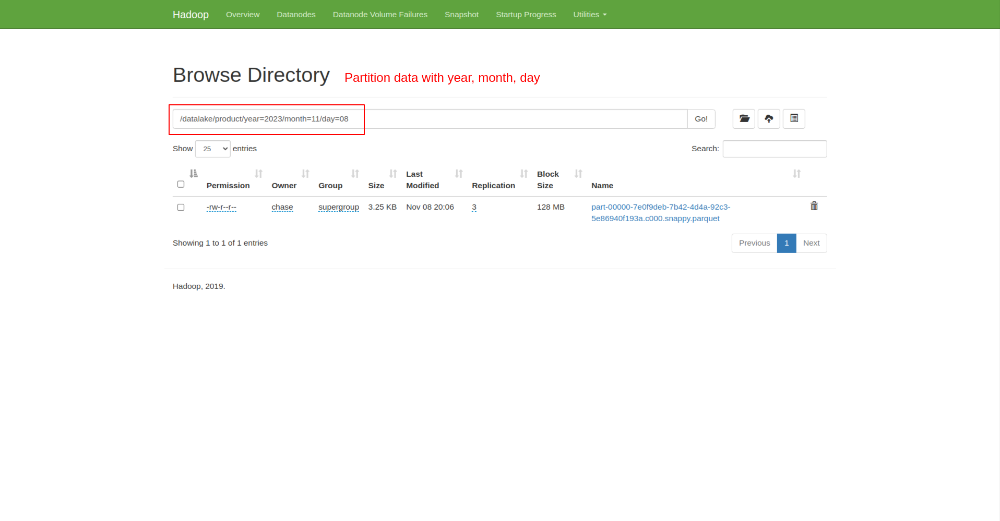

# ETL process data lake and data warehouse

Data Integration (ETL) process with Hadoop, Hive, Pyspark, PostgreSQL

## Prerequisites

- Docker
- Pyspark
- PostgreSQL

## Ingest data from external source to data lake

### 1. Setup schema and import data from csv

Run script `sql/schema.sql` to create table and load data from csv in folder `data` to generate data

<i>These data are generated by [Mockaroo](https://www.mockaroo.com/)</i>

### 2. Run Hadoop, Hive service with Docker

You can run below command to run Hadoop, Hive services with docker:

```bash
$ docker compose up -d
```

or

```bash
$ make run-services
```

### 3. Ingest data from PosgreSQL to data lake

Update PostgreSQL config in `src/config.py`

```python
PSQL_HOST = "YourPSQLHost"
PSQL_PORT = YourPsqlPort
PSQL_DB = "YourDBName"
PSQL_USER = "YourPSQLUser"
PSQL_PASSWORD = "xxxxx-yyyy"
```

After update the PSQL config, you can run command below to ingest to data lake

```bash
$ make transform EXECUTE_DATE=2023-11-08 TABLE=product
```

- **EXECUTE_DATE**: The data lake is partitioned by `year, month, day`. This facilitates easier access to data based on the time of entry

- **TABLE**: The target table. Base on the schema, it could be `product, user, order, order-detail`

Access to http://localhost:9870 in your browser, select `Utilities` > `Browse the file system` > `datalake`, then select the target to check the results



## Transform data from data lake to data warehouse

### 1. Create data warehouse with Hive

Copy file `sql/create_warehouse.sql` to Hive server and run the script

```bash
$ docker cp sql/create_warehouse.sql hive-server:/tmp/create_warehouse.sql
$ docker exec -it hive-server bash
hive-server:$ cd /tmp
hive-server:$ hive -f create_warehouse.sql
```

You can check database location on http://localhost:9870. In my case the location is `/user/hive/warehouse`

### 2. Run command to perform transform

```bash
$ make transform EXECUTE_DATE=2023-11-08
```

- **EXECUTE_DATE**: The script collect all orders in execute date and calculate to get total sales, revenue and store to data warehouse

<i>NOTE: Order dates in csv data are limited from 2023-11-01 to 2023-11-31. Therefore, you should be careful to choose the correct execute date</i>

Exec to Hive container and run Select query to check the results

```bash
docker exec -it hive-server bash
hive-server:$ hive
hive:$ select * from reports.daily_gross_revenue;
```
